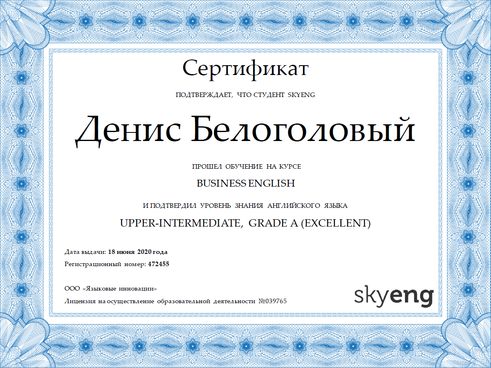
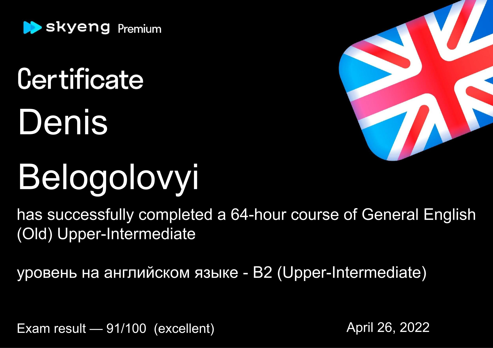
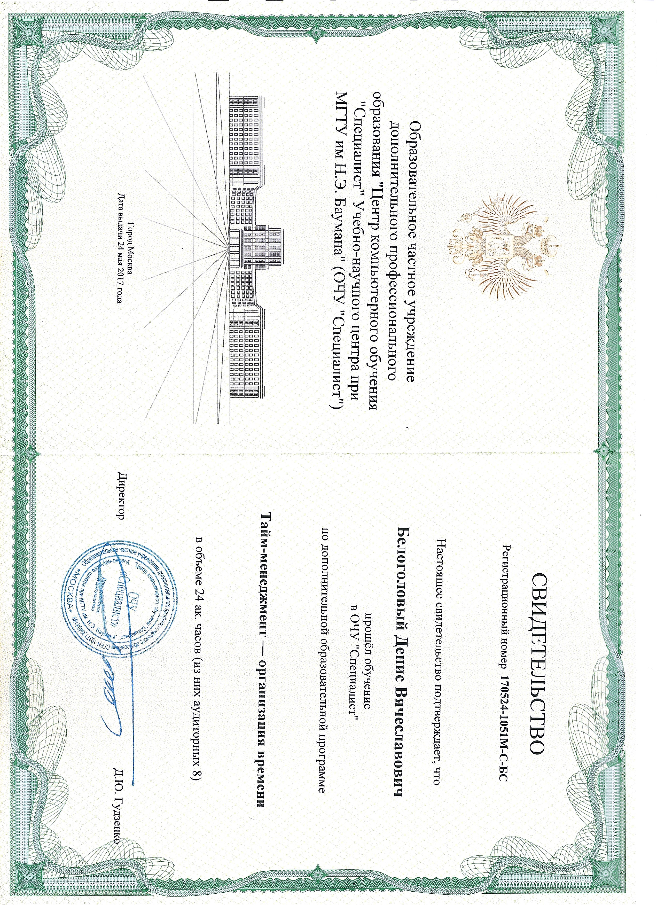
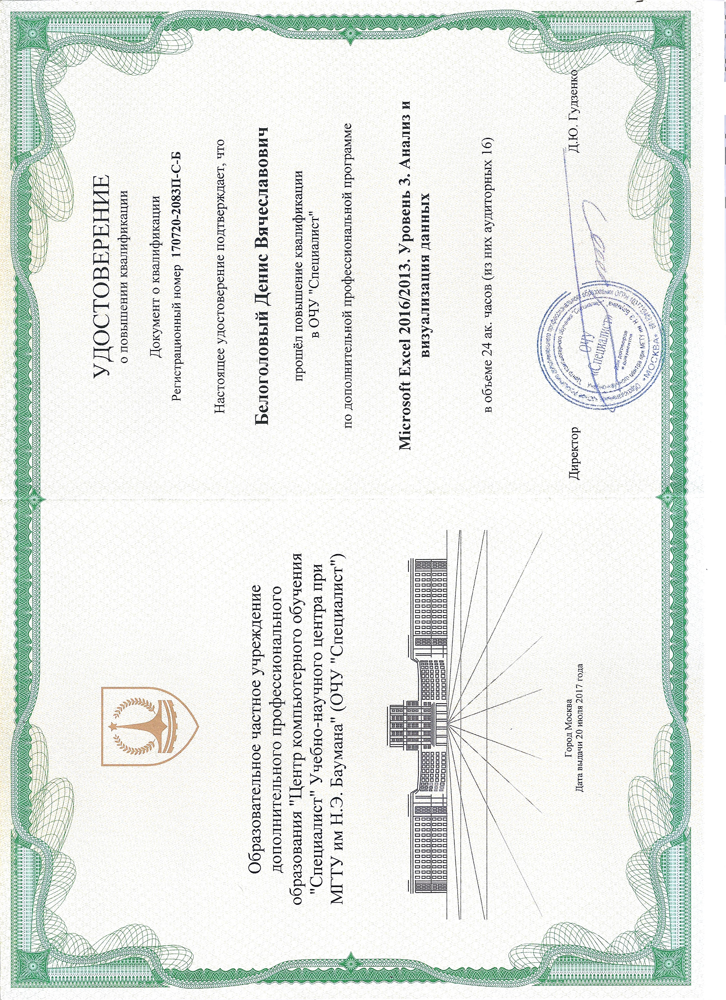
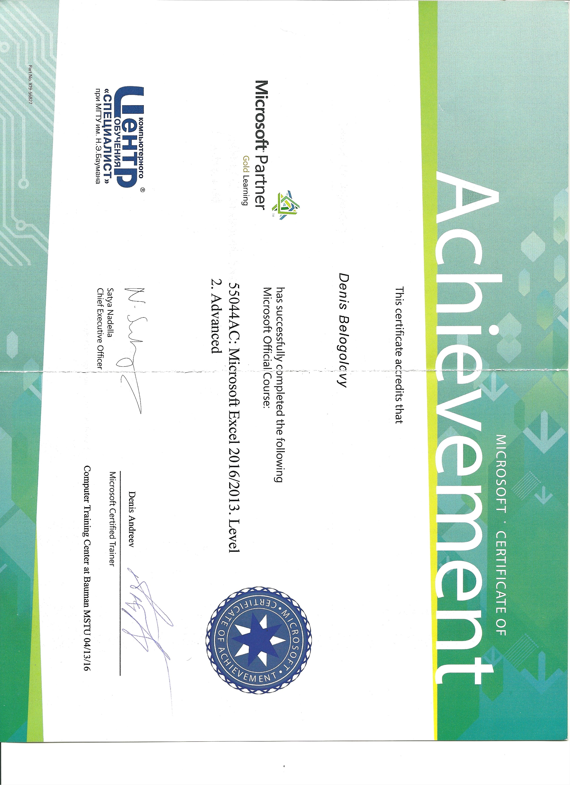
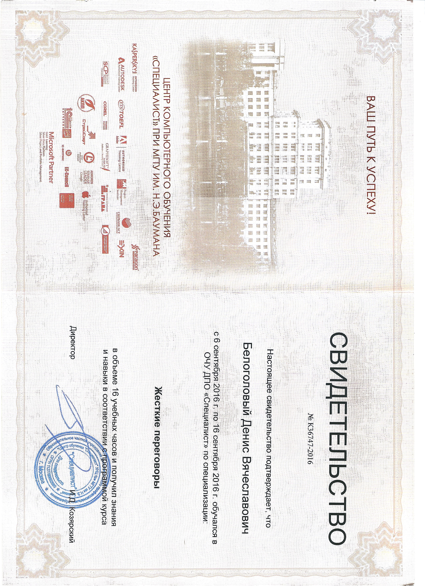

#### Школа начинающих тестировщиков Ольги Назиной
<kbd></kbd>

#### Business Upper Intermediate English
<kbd></kbd>

#### General Upper Intermediate English
<kbd></kbd>

#### Тайм-менеджмент - организация времени
<kbd></kbd>

#### Microsoft Excel: Анализ и визуализация данных
<kbd></kbd>

#### Microsoft Excel: Advanced
<kbd></kbd>

#### Эффективные переговоры
<kbd></kbd>

#### Жесткие переговоры
<kbd></kbd>

